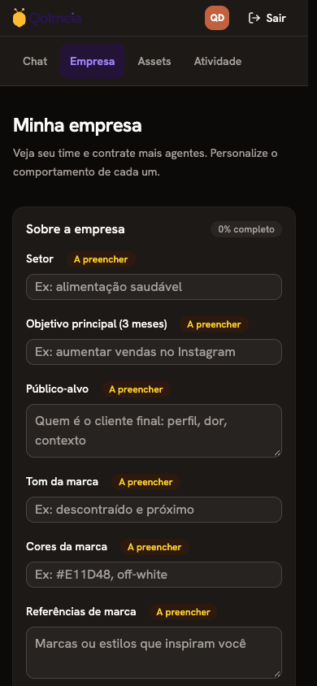
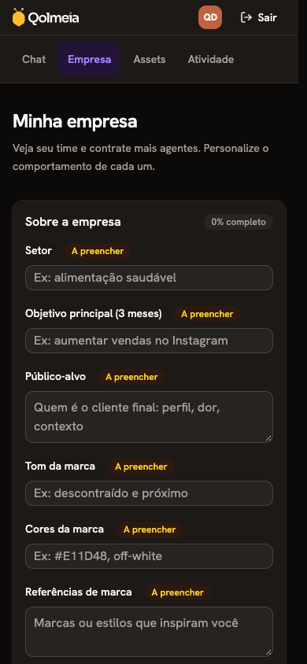
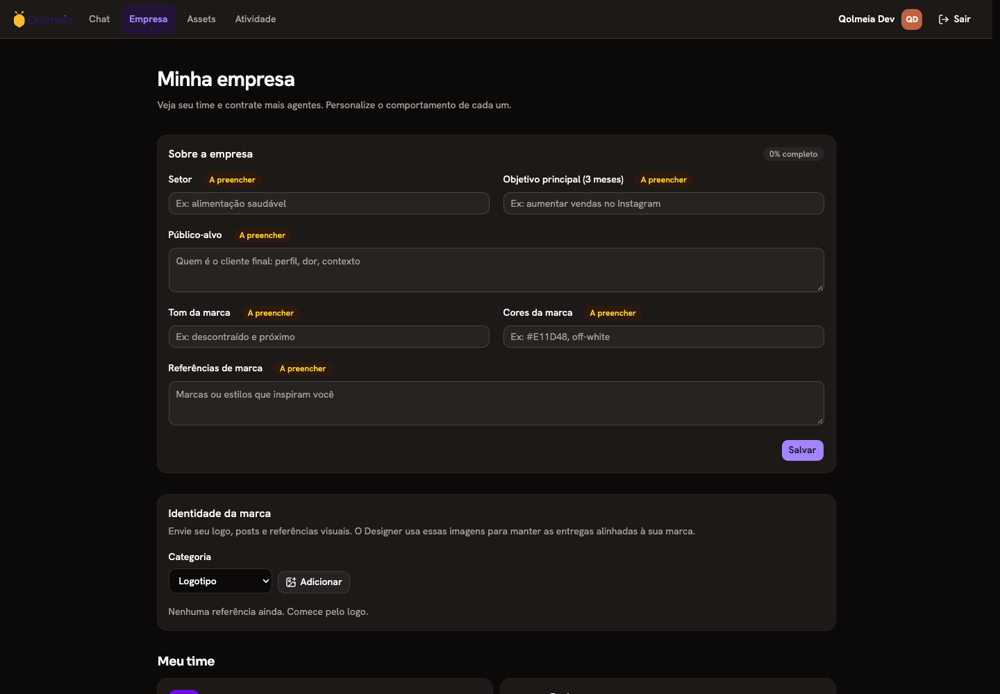
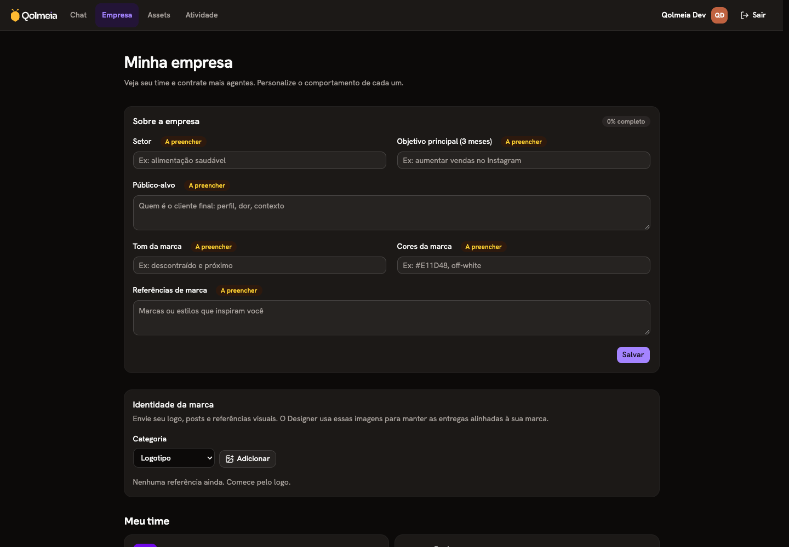
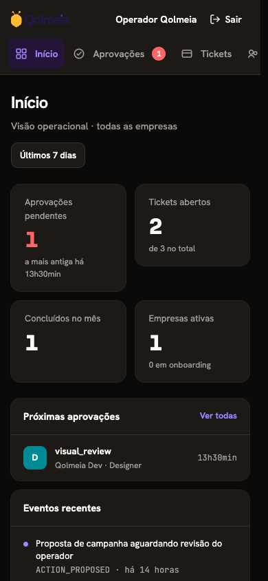
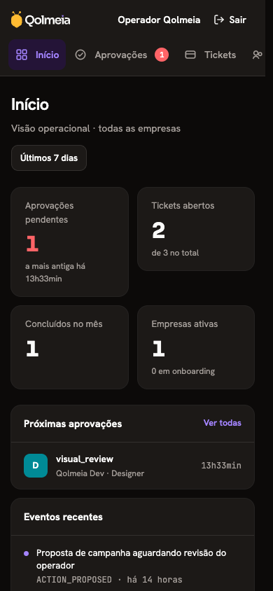
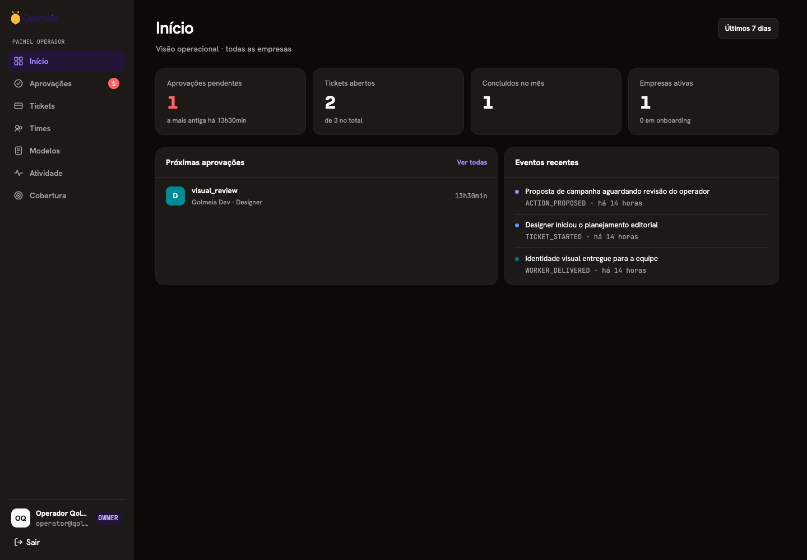
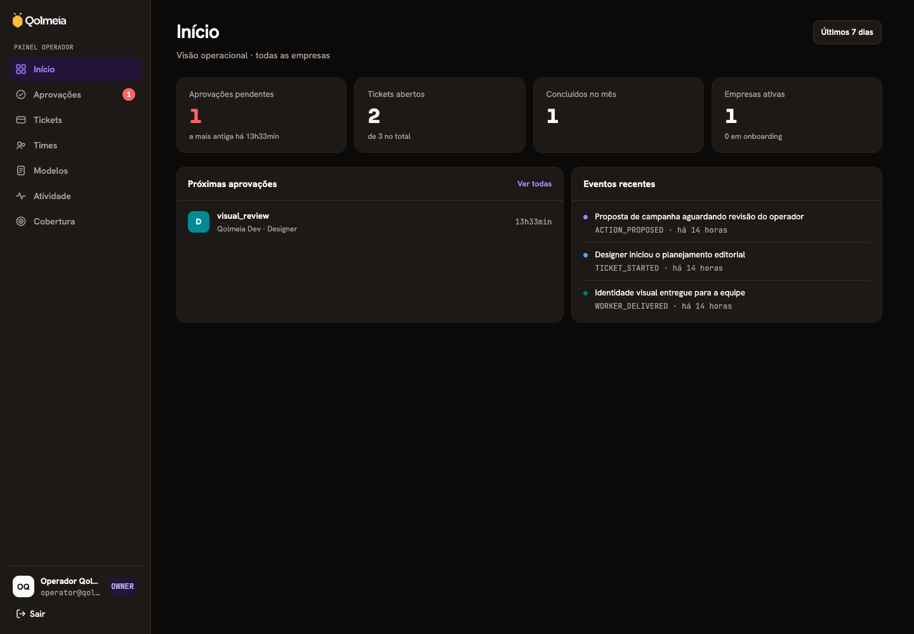

# Dark-mode logo repair

System dark mode introduced by the shadcn rollout left the logo wordmark using its light-theme dark-purple ink. On the dark header it became almost invisible. The dark theme now maps the logo ink and purple to the foreground and primary tokens; the honey accent and light-theme branding remain unchanged. No registry primitives or lint policies change.

These screenshots compare the exact repair PR base, `b6a0cab8fec1f6d83f7df03bf1947bf246e63bdc`, with this fix. Both sides use dark system preference, the same local seeded accounts, and the same viewport.

| Surface                       | Before                                  | After                                 |
| ----------------------------- | --------------------------------------- | ------------------------------------- |
| Customer company page, 390px  |          |          |
| Customer company page, 1440px |         |         |
| Operator home, 390px          |   |   |
| Operator home, 1440px         |  |  |

The broader regression audit compared the pre-standardization base `218ccd7d2649be7591bad500db7d877d45161efa` with the current application: landing, authentication, populated operator home/approvals/tickets/activity, teams, templates, coverage, customer company/hire dialog, chat and asset states. Main pages were checked at 1440px and 390px, with narrow layouts and dialogs also checked at 320px. Both light and dark preferences were exercised. Stock component sizing and the newly enabled system dark theme are intentional.

Chat messages and asset previews used temporary local fixtures rendering the real components; live agent generation and external provider integration were outside this visual audit. The temporary routes were removed. Pre-existing narrow asset-preview clipping and chat viewport-height behavior were reproduced on both revisions.
