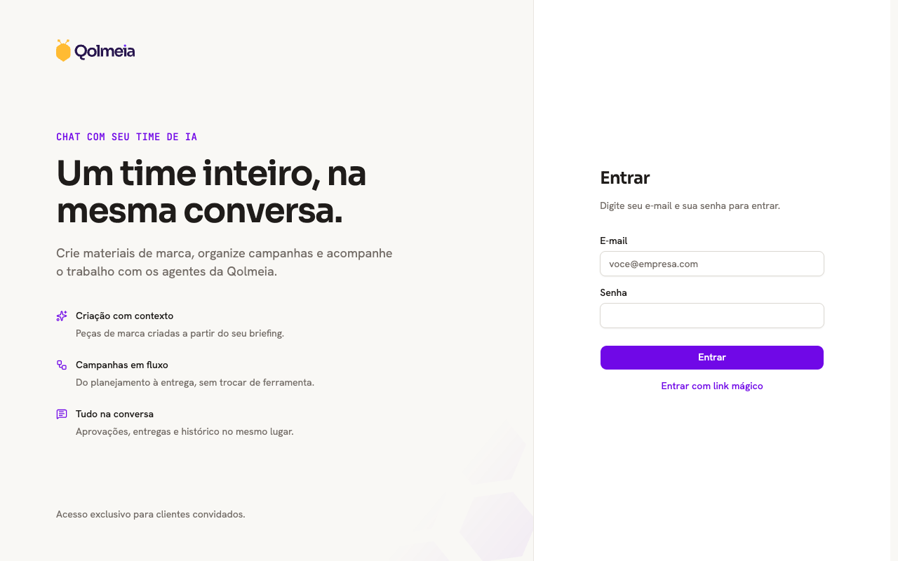
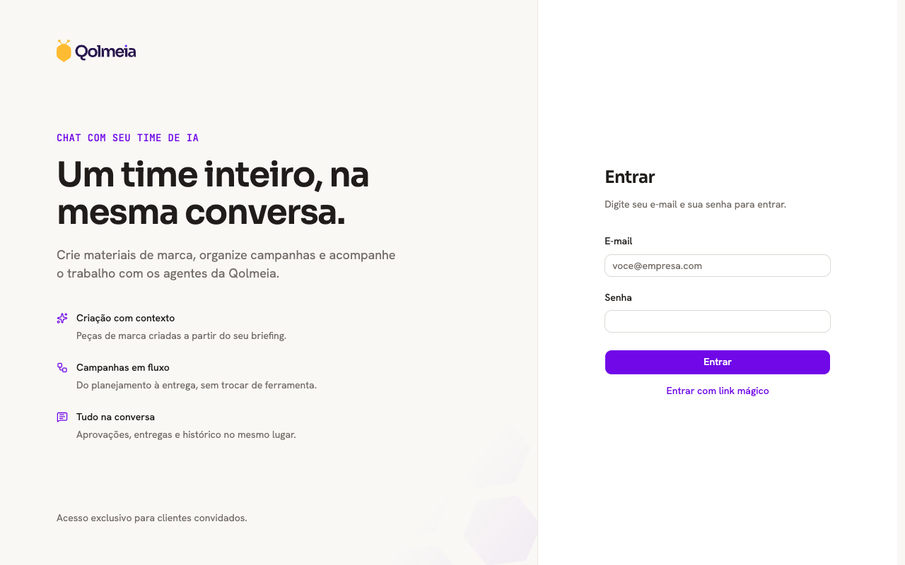
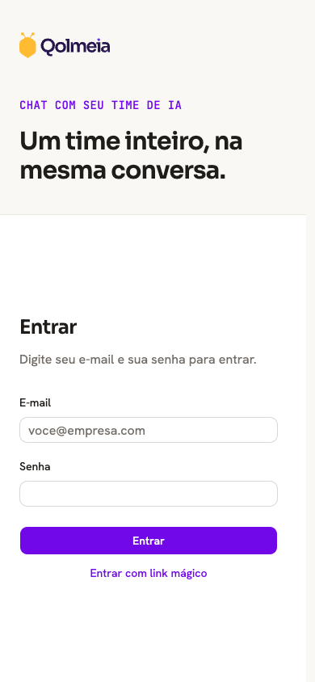

# shadcn visual comparison

Before: `218ccd7d2649be7591bad500db7d877d45161efa` (PR merge base).

After UI source: `c28d98c9b5d3c56e55d8f23f485b573cedaa7aa5`. Later commits in this PR only add review evidence.

Login inputs become shorter and flatter, with small vertical spacing changes. The purple/yellow branding and desktop split/mobile stacked layout remain.

Manually compared matching desktop (1280×800) and mobile (390×844) viewports in Chromium, light theme, reduced motion. No horizontal overflow or unexpected clipping was observed in the sampled after states. This covers the pages/states below, not every screen, authenticated flow, or dark-mode state.

## Empty login form

App: `web`. Route: `/login`. Same route and state on both commits.

Desktop

| Before                              | After                             |
| ----------------------------------- | --------------------------------- |
|  |  |

Mobile

| Before                             | After                            |
| ---------------------------------- | -------------------------------- |
|  |  |
